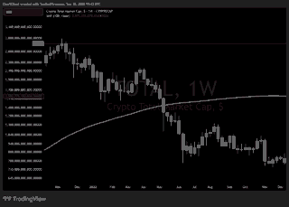

<div class="kicker">The evidence</div>

# Show the chart first.

<p class="lede">This is the living notebook. Real screenshots, fixed overlays, measurements, failures, counterexamples and unresolved cases belong here.</p>

A serious entry should read in this order:

**chart → caption → observation → interpretation → measured result → status**

Do not make the reader cross a wall of prose before seeing the evidence.

## TOTAL · 1D · 2024–2025 · roll around the previous-cycle white


**CAPTION**

TOTAL · 1D · 2024–2025. Previous-cycle anchors: `0 = $0.728T`, `1 = $3.010T`. Local corridor around the old white 1.000: lower recursive yellow `≈ $2.821T`, white `= $3.010T`, upper recursive yellow `≈ $3.297T`.

**OBSERVATION**

Price undergoes large expansion and contraction around the old 1.000 region. During the same period, the magenta daily SMA100 moves much more smoothly: it rises through the lower recursive yellow, crosses the old white boundary, and approaches the yellow in the upper neighbouring container before the larger roll develops.

The relevant corridor straddles a shared white boundary: the lower yellow belongs to the lower container and the upper yellow belongs to the upper container.

**INTERPRETATION**

The event may be an example of volatile nested expansion/contraction drawing a smooth slow trajectory that is itself organised around fixed structure.

Smoothness alone is expected from a 100-day average. The unresolved question is whether the structural placement of that smooth roll is unusual.

**MEASURED RESULT**

Not yet scored. Required next measurements include corridor entry, white crossing, closest approach to each yellow, SMA crest and trough, zero-slope dates, curvature, structural displacement `d(t)`, 100-day forcing `q100(t)`, multiresolution consistency, nearby-horizon controls and matched random corridors.

**STATUS**

<p class="status unresolved">UNRESOLVED</p>

### Anchor reference



The previous-cycle reference identifies the approximately `$3.010T` high and `$0.728T` low used for this fixed-ladder traversal study.

Until structural provenance is established, this historical case should not be described as an ex-ante prediction.

---

## Evidence block

<div class="evidence-block">
  <span class="label evidence">CHART</span>

  <p><code>charts/YYYY-MM-DD-asset-timeframe-short-description.png</code></p>

  <span class="label">CAPTION</span>

  <p><strong>ASSET · TIMEFRAME · DATE RANGE</strong><br>
  Parent container: <code>A → B</code> · Current interval: <code>…</code> · Value: <code>…</code> · Position: <code>…</code> · SMA100: <code>…</code></p>

  <span class="label">OBSERVATION</span>

  <p>State only what is visible or measured.</p>

  <span class="label">INTERPRETATION</span>

  <p>State what the observation might mean. This can remain blank.</p>

  <span class="label">MEASURED RESULT</span>

  <p>Only where a predefined trading or market test applies.</p>

  <span class="label">STATUS</span>

  <p class="status unresolved">UNRESOLVED</p>
</div>

## Chart standard

Where possible, an annotated chart should visibly identify asset, timeframe, date range, parent container, current interval, current value, normalized structural position, relevant child levels, SMA100 value, SMA slope state, and the event being illustrated.

Use the same colour language as the structure itself:

**white boundary · blue level · yellow 0.236/0.786 · magenta SMA100**

The machine-readable vocabulary shared by trading and market research is defined in **[EVENT_SCHEMA.md](EVENT_SCHEMA.md)**.

## Observation fields

Use only the fields that help the case:

```text
asset
timeframe
start_time
end_time
parent_container_low
parent_container_high
nearest_level
nearest_level_type
price
container_position
sma100
sma_slope_state
price_parallelism
sma_parallelism
parallel_duration_bars
convergence_state
crossing_event
retest_event
step_count
reversal_count
container_exit_side
source_image
notes
```

The notebook does not need every field every time. Trading decision records additionally use the Machine v0.1 fields for decision level, commitment boundaries, first boundary, surviving hypothesis, resolution, returns and chronology status.

## Status language

<p class="status supportive">SUPPORTIVE</p>
<p class="status contradictory">CONTRADICTORY</p>
<p class="status unresolved">UNRESOLVED</p>
<p class="status">DESCRIPTIVE ONLY</p>

A status describes the observation's relationship to the current question. It is not a global verdict on the project.

## Keep the distinctions hard

**Observation** — what happened.

**Interpretation** — what it may mean.

**Hypothesis** — the broader proposition under test.

**Trading rule** — what the method said to do.

**Measured result** — how the predefined test scored.

A beautiful chart is not automatically proof. A profitable structural trade does not prove the SMA hypothesis.

## Add a new case

1. Save the original or annotated image in `charts/`.
2. Put the image first in the entry.
3. Add the short caption and structural address.
4. Record observation before interpretation.
5. Add the measured result only if a rule was defined in advance.
6. Leave unresolved cases unresolved.

New entries go at the top.
